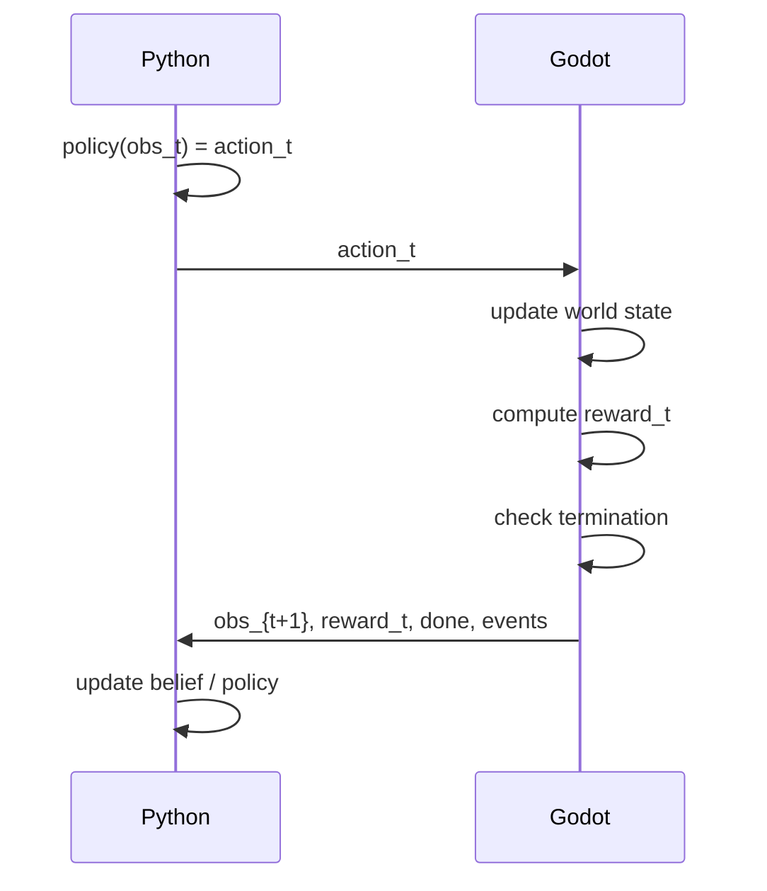

# Project Goal
We first build a simplified 1v1 environment to study opponent strategy changes under partial observability.The design should allow future extension to 2v2 gameplay.

This simulator should support scripted opponents, hidden information, combat interaction, and logging for later learning/ evaluation.

---
# Project Structure

```
Project
│
├── Godot Side
│   ├── Map / Scene
│   ├── Entities
│   ├── Core Mechanics
│   ├── Visibility / Observation Export
│   ├── Reward / Termination
│   └── Simulator Interface
│
├── Python Side
│   ├── Environment Wrapper
│   ├── Baseline Agent
│   ├── Opponent / Scripted Policies
│   ├── Belief / Reasoning Module
│   ├── Experiment Runner
│   └── Evaluation / Logging Analysis
│
└── Shared Interface
    ├── Observation Format
    ├── Action Format
    ├── Config Format
    └── Episode Log Format
```
## Responsibility

### Godot 

- World state and simulation updates
- Combat, collision, visibility, reward, and episode termination
- Exporting structured observations and logs
- Not responsible for
	- Belief Inference
	- Experiment scheduling
	- Evaluation metrics beyond basic environment reward


### Python
- Agent decision logic
- Scripted policies
- Belief / reasoning modules
- Experiment control and analysis
- Non responsible for
	- Direct world-state mutation
	- collision/combat resolution
    
---
# Core

The first prototype should include:

```
- Environment loop (reset, step, termination)
- 1v1 env with 2 agents
- Movement and combat mechanics
- Partial observability (bushes/hidden regions)
- Scripted opponent strategy library
- Opponent strategy switching
- Observation/Action API
- Episode logging 
- Rule base baseline agent
- Basic reward
- Reasoning module
```

---
# Extensions

These features are optional and should not break the core schema.

Possible extensions:

```
- Minion wave  
- Tower/nexus 
- Jungle path and neutral objectives
- Ward system
- Richer terrain / visibility structures  
- Leveling   
- Skills and mechanics cooldown 
- 2v2  
- Different Characters 
```

---
# Step Flow



```python
obs = env.reset(config)

while not done:

    action = policy(obs)

    obs, reward, done, info = env.step(action)

    log(obs, reward)
```

---
# Simulator API
## 1. reset(config)

Starts a new episode
### Input
```
config: environment configuration
```
### Output
```
obs_dict
```
Initial observation for each agent

```
obs_dict = {agent_id: obs}
```

Example:
```
obs_dict = env.reset(config)
```

## 2. step(action_dict)

Advances the simulator by one timestep.

### Input
```
action_dict
```
Actions for all active agents

```
actions = {agent_id: action}
```

Example:
```
actions = {
	0: action_agents,
	1: action_opponent
}
```
### Output
```
obs_dict_next
reward_dict
done
event_log
```

Example
```
obs_next, reward, done, events = env.step(actions)
```

---
# Formats

## Observation Format
```json
obs = {
    "self_id": int,
    "timestep": int,

    "agents": [
        {
            "id": int,
            "team": str,
            "visible": bool,
            "position": [x, y] | None,
            "hp": float | None,
            "status": {
                "alive": bool
            }
        }
    ],

    "objects": [
        {
            "id": int,
            "type": str,
            "team": str | None,
            "position": [x, y]
        }
    ],

    "extensions": {}
}
```
### Notes
- `agents` is a **list** so the simulator supports **1v1 and 2v2**
- `self_id` identifies which agent this observation belongs to
- invisible agents still appear but may hide fields
- `objects` represent non-agent entities

Examples of objects:
- towers
- minions
- wards
- jungle monsters

## Action Format
```JSON
action = {
    "agent_id": int,
    "move": [dx, dy],
    "attack": bool,
    "target_id": int | None,
    "extensions": {}
}
```

Core actions:
- movement
- attack
Extensions may include
- skills
- ward placement

## Config Format

The configuration controls environment parameters and optional extensions.

```JSON
config = {
    "core": {
        "map_name": "basic_arena",
        "random_seed": 42,
        "max_steps": 300,
        "num_teams": 2,
        "agents_per_team": 1,
        "vision_range": 5.0,
        "opponent_strategy": "aggressive",
        "strategy_switch_mode": "time_based"
    },

    "extensions": {
        "minion_wave": False,
        "tower": False,
        "jungle": False,
        "wards": False,
        "leveling": False,
        "skills": False,
        "mode_2v2": False
    }
}
```

### Randomness
The simulator may include stochastic elements such as:
- damage variance
- strategy switching schedules
- spawn timing for extension systems

To ensure **reproducible experiments**, a `random_seed` can be provided in the config.
When the same seed is used, the simulator should produce identical stochastic outcomes.

---

# Reward
The simulator provides a **default environment reward**.

Example reward:
```
reward =  
	+0.1 * damage_dealt  
	-0.1 * damage_taken  
	+10  if enemy killed  
	-10  if agent died  
	-0.01 step cost
```

Reward is computed **after action execution**.

Reward is mainly used for:

- RL compatibility
- quick performance comparison

---
# Termination

`done = True` when an episode ends.

Termination conditions:
```

agent_dead  
OR  
enemy_dead  
OR  
timestep >= max_steps
```

---

# Episode Log

The simulator records events during each episode.

```JSON
event = {
	"timestep": int,
	"event_type": str,
	"source_id": int | None,
	"target_id": int | None,
	"payload": dict # event-specific information
}
```

Event types 
```
move
attack
damage
death
strategy_switch
enter_bush
exit_bush
spotted_enemy
lost_sight
episode_end
```

---
# Map

The environment uses a **continuous 2D space** rather than a grid-based tile system.

Agent positions are represented using continuous coordinates.

```
Example:

agent_position = (x, y)
```

Agent movement is simplified using **constant velocity dynamics**.

## Design Goals

The map should satisfy the following properties:

- **Symmetric layout** to ensure fairness between teams
- A **central lane** where most combat interactions occur
- **Jungle paths** that allow hidden movement and rotations (extension)
- **Bush regions** that create partial observability

## Core Map

The **core environment** uses a simplified layout with a single lane and bush regions.

This version focuses on the minimal mechanics required for studying:

- combat interaction
- partial observability
- opponent strategy inference

![[Screenshot 2026-03-16 at 16.55.40.png]]

## Extension Map

A more complex map can be introduced as an **extension**.

This version may include:

- jungle paths
- towers
- additional bushes
- neutral objectives

These elements increase the strategic complexity of the environment but are **not required for the core simulator**.

![[Screenshot 2026-03-16 at 16.57.19.png]]

## Observation Range

Agents observe the environment within a limited vision radius.

To ensure partial observability while still allowing meaningful interactions, the observation radius should be **smaller than the map size but large enough to capture nearby combat**.

A practical guideline is:
```
observation_radius ≈ 0.2 – 0.3 × map_size
```

Example configuration:
```
map_size = 30  
observation_radius = 6
```
This allows agents to observe nearby interactions while still leaving large areas of the map unobserved, enabling hidden movement through bushes or jungle paths.

## Map Knowledge

Agents are assumed to know the static map layout, including lane structure,  
bush locations, and terrain boundaries.  
  
Partial observability only applies to dynamic information such as  
opponent positions, hidden movement, and events outside the vision ran

---

# Work Areas

### 1. Simulator Core (Godot)

Core environment mechanics.

Tasks include:
- world update loop
- agent movement and combat
- collision and physics
- visibility / bush mechanics
- observation generation
- reward and termination
- simulator API (`reset`, `step`)

### 2. Environment Systems

Map and environment mechanics.

Tasks include:
- terrain and map features
- bush / hidden regions
- environment objects
- visibility interactions

### 3. Opponent Strategies

Scripted opponent behaviors.

Tasks include:

- aggressive / defensive strategies
- ambush behaviors
- strategy switching
- additional strategies

The strategy framework will be maintained centrally, but **new strategies are open for contribution**.

### 4. Experiments and Logging

Experiment infrastructure and analysis tools.

Tasks include:

- event logging
- episode logs
- experiment runner
- replay tools
- result visualization

### 5. Inference / Reasoning / RL

Core research module.

Tasks include:

- opponent strategy inference
- belief modeling
- reasoning-based agents
- reinforcement learning agents (optional)
- evaluation metrics

Extensions can be developed **in parallel** and should follow the shared interfaces and be controlled through **config flags**.

---

