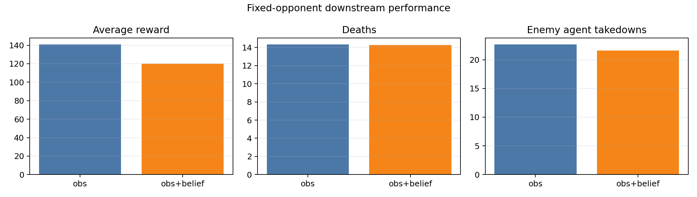
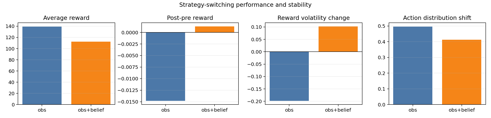
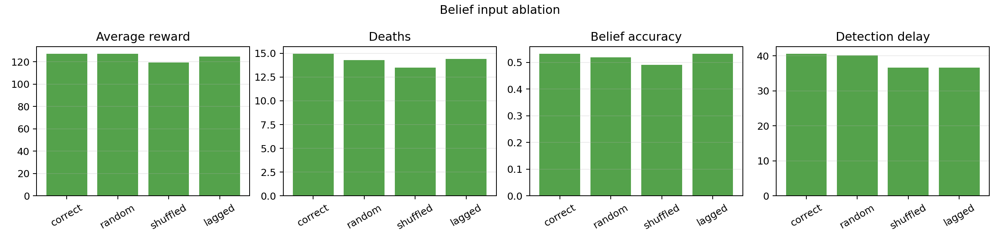

# Paper Belief Analysis

This report is generated from existing evaluation JSON files and is intended to provide paper-ready tables, figures, and interpretation notes.

## Table 1: Downstream Performance on Fixed Opponents

| policy | input | avg_reward | worst_reward | reward_gap | avg_win_rate | avg_deaths | avg_agent_takedowns | avg_minion_takedowns |
| --- | --- | --- | --- | --- | --- | --- | --- | --- |
| aggressiveExpert_neutral | obs | 140.953 | 109.8512 | 51.082 | 0.0133 | 14.34 | 22.6733 | 20.9333 |
| aggressiveExpert_neutral_belief | obs+belief | 119.9651 | 89.492 | 54.4178 | 0.0067 | 14.2467 | 21.5867 | 17.7533 |

## Table 2: Strategy-Switching Stability

| policy | input | eval_config | avg_reward | avg_win_rate | avg_deaths | avg_agent_takedowns | avg_minion_takedowns | switch_reward_delta | switch_reward_std_delta | switch_action_shift |
| --- | --- | --- | --- | --- | --- | --- | --- | --- | --- | --- |
| aggressiveExpert_neutral | obs | strategySwitching_onlyOBS | 139.3384 | 0.02 | 14.62 | 22.8 | 21.06 | -0.0148 | -0.1981 | 0.496 |
| aggressiveExpert_neutral_belief | obs+belief | strategySwitching_belief | 112.4393 | 0.0 | 14.0 | 20.86 | 17.48 | 0.0013 | 0.1022 | 0.4128 |

## Table 3: Belief Minus Observation Deltas

| comparison | reward_delta | death_delta | agent_takedown_delta | minion_takedown_delta | switch_reward_delta_delta | switch_std_delta_delta | action_shift_delta |
| --- | --- | --- | --- | --- | --- | --- | --- |
| belief - observation | -20.9879 | -0.0933 | -1.0866 | -3.18 | 0.0 | 0.0 | 0.0 |
| belief - observation | -26.8991 | -0.62 | -1.94 | -3.58 | 0.0161 | 0.3003 | -0.0832 |

## Table 4: Perturbed-Belief Ablation

| policy | belief_mode | eval_config | avg_reward | avg_win_rate | avg_deaths | avg_agent_takedowns | avg_minion_takedowns | belief_accuracy | post_switch_accuracy | switch_detection_delay | belief_entropy |
| --- | --- | --- | --- | --- | --- | --- | --- | --- | --- | --- | --- |
| aggressiveExpert_neutral_belief | correct | strategySwitching_belief | 126.9331 | 0.0 | 14.96 | 22.34 | 16.98 | 0.5328 | 0.4826 | 40.625 | 0.9596 |
| aggressiveExpert_neutral_belief | lagged | strategySwitching_belief | 124.7269 | 0.0 | 14.42 | 21.88 | 18.24 | 0.5319 | 0.4908 | 36.6522 | 0.9605 |
| aggressiveExpert_neutral_belief | random | strategySwitching_belief | 127.2314 | 0.0 | 14.26 | 22.02 | 17.8 | 0.5183 | 0.474 | 40.1087 | 0.9632 |
| aggressiveExpert_neutral_belief | shuffled | strategySwitching_belief | 119.277 | 0.04 | 13.5 | 20.94 | 16.76 | 0.4907 | 0.4613 | 36.587 | 0.9688 |

## Analysis Summary

- On fixed opponents, the belief-conditioned policy changed average reward by `-20.9879` relative to the observation-only baseline. Deaths changed by `-0.0933`.
- Under strategy switching, the belief-conditioned policy changed average reward by `-26.8991`. The post-switch reward delta changed by `0.0161`, reward volatility changed by `0.3003`, and action-shift changed by `-0.0832`.
- Correct belief reward vs random belief reward: `126.9331` vs `127.2314`. This tests whether the policy uses belief semantics rather than only the extra input dimensions.
- Correct belief reward vs shuffled belief reward: `126.9331` vs `119.277`. A shuffled drop would indicate that the meaning of each belief dimension matters.
- Correct belief reward vs lagged belief reward: `126.9331` vs `124.7269`. This tests whether current strategy inference is more useful than stale inference.
- Interpretation note: belief can still be scientifically useful even when it does not improve final reward, because the ablations test whether the policy actually uses the inferred opponent-state signal.
